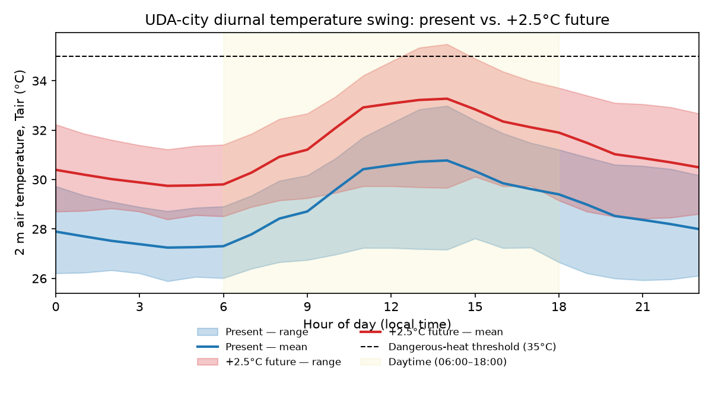

# SUEWS Hackathon — Practice Repo

This is a **practice repository** for the SUEWS Community Hackathon, run against the
real challenge dataset, [UMEP-dev/uda-city-hackathon](https://github.com/UMEP-dev/uda-city-hackathon),
which is public ahead of/at kickoff. This is a rehearsal of the pipeline and the
analysis approach, not a hackathon submission — the judged entry is a separate
repository created under the `UMEP-dev` organisation on the day.

## Pipeline smoke test

Before the real analysis, a minimal SUEWS run via [supy](https://supy.readthedocs.io/)
(the Python interface suews-agent wraps) confirmed the tooling works end to end, using
supy's own bundled sample dataset — see [`analysis/smoke_test.py`](../analysis/smoke_test.py)
and its [output](../analysis/smoke_test_output.txt).

## The question

Across UDA-city's ten neighbourhoods, **is the hottest place also the highest-risk
place?** We ran SUEWS for the present hot-humid season and a +2.5 °C hotter-future
pseudo-warming, derived a dangerous-heat-hours hazard layer, and bridged it to a
socio-economic heat-risk indicator using the dataset's reference bridge
(`risk_bridge.py`), following a UNDRR-style decomposition:

```
risk = (hazard × exposure × vulnerability) ^ (1/3)
```

each pillar min–max scaled to `[0, 1]` across the ten neighbourhoods. Hazard is
dangerous-heat hours (hourly-mean 2 m air temperature, `T2`, above 35 °C, illustrative
threshold, after a 14-day spin-up discard). Exposure is daytime population density.
Vulnerability combines five proxies: elderly/under-5 share, lack of AC access, outdoor
workers, and a deprivation index.

## Method

- **Model**: SUEWS v2026.6.5 (via supy), canonical config `uda-city.yml` — NARP net
  radiation + classic OHM storage heat, 10 grids run in parallel.
- **Forcing**: ERA5-derived hourly point series for a coastal, hot-humid setting
  (2024-03-02 to 2024-06-01 local; March is spin-up, the April–May window is analysed).
- **Scenarios**: *present* (direct ERA5) and *future* (+2.5 K uniform pseudo-warming,
  RH held constant, longwave-down scaled for grey-body consistency).
- **Anthropogenic heat is off** in both scenarios; population density feeds exposure and
  vulnerability, not the model's heat input.

## Results

**Dangerous-heat hours, present vs. +2.5 °C future** (full tables:
[present](../analysis/outputs/risk_present.csv), [future](../analysis/outputs/risk_future.csv)):

| Neighbourhood | Type | Hazard hrs (present) | Hazard hrs (future) | Risk rank (both) |
|---|---|---:|---:|---:|
| Kampong Lama | hotspot | 42 | 249 | **1** |
| Dhobi Lines | hotspot | 26 | 217 | 2–3 |
| Fuzhou Lanes | hotspot | 22 | 212 | 2–3 |
| Mlima Moto | hotspot | 5 | 149 | 4 |
| Lusitano Square | core | 5 | 129 | 5 |
| Victoria Exchange | core | 5 | 120 | 6 |
| Jade Gardens | refuge | **62** | **260** | 7 (tied last) |
| Taman Melati | refuge | 47 | 243 | 7 (tied last) |
| Serendib Rise | refuge | 26 | 205 | 7 (tied last) |
| Zheng He Towers | core | 2 | 77 | 7 (tied last) |

Two findings stand out:

1. **The hottest neighbourhoods are not the highest-risk ones.** The *refuge*
   neighbourhoods (Jade Gardens, Taman Melati) post the most dangerous-heat hours in
   both scenarios — low building roughness means weaker turbulent mixing and warmer
   near-surface air under NARP — but with zero exposed daytime population they rank
   **last** on risk. The dense informal *hotspot* neighbourhoods (Kampong Lama, Dhobi
   Lines, Fuzhou Lanes) have markedly fewer hazard hours yet rank **highest** risk,
   driven by exposure (300 people/ha) and vulnerability (low AC access, high outdoor
   work, high deprivation).
2. **Warming amplifies the hazard sharply but barely reshuffles the risk ranking.**
   Dangerous-heat hours rose 4–80× across neighbourhoods under +2.5 °C (e.g. Kampong
   Lama 42→249 hours), yet the risk-rank order is essentially unchanged — because
   exposure and vulnerability, not hazard, are what separate the top and bottom of the
   table here. That stability is itself informative: it suggests near-term adaptation
   priority (who needs protecting first) is robust to this warming scenario, even
   though the absolute hazard everyone faces is far higher.

## What's actually driving this

Three separate mechanisms stack to produce the ranking above, and they don't all point
the same way:

- **Hazard ← morphology, not vegetation.** *Refuge* neighbourhoods have the lowest
  building footprint and roughness in the dataset (plan-area fraction `λp` 0.047–0.073,
  frontal area index `λf` 0.02–0.07) — low roughness means weak turbulent mixing, so
  near-surface air stays warmer under NARP, *despite* refuge having the most vegetation
  and water cover of any neighbourhood type (≈26% combined vs. ≈7% for hotspots). Surface
  greenery does not translate into lower hazard at this grid-average scale.
- **Exposure ← population density**, not building density. Across the ten
  neighbourhoods, population density correlates strongly with the final risk score
  (r ≈ 0.73 — though this is partly definitional, since population *is* the exposure
  pillar). Building footprint density does **not** (r ≈ 0.12) — denser-built
  neighbourhoods aren't meaningfully riskier here. The two kinds of "density" are easy to
  conflate and behave completely differently in this model.
- **Vulnerability ← adaptive capacity, not just exposure.** Holding population density
  roughly constant (hotspot ≈300/ha vs. core ≈250/ha) isolates the effect: hotspot
  neighbourhoods have ~10x worse scores on AC access (0.06–0.10 vs. 0.70–0.78), outdoor
  work (60–65% vs. 18–22%), and deprivation (0.80–0.85 vs. 0.25–0.30). That gap — not
  hazard, not even exposure — is what actually separates hotspot (rank 1–4) from core
  (rank 5–6). Deprivation alone correlates at r ≈ 0.87 with risk, but treat that as the
  formula working as designed (deprivation is a direct input to vulnerability), not an
  independent discovery.

**A scaling artifact worth naming explicitly.** The bridge min–max scales each pillar
*across these ten neighbourhoods only*, then takes a geometric mean. Whichever
neighbourhood is the dataset's minimum on any single pillar gets scaled to exactly 0,
which zeroes the whole risk index regardless of the other two pillars. That is
mechanically why *refuge* (population minimum) and Zheng He Towers (hazard minimum) both
land at risk = 0 — it reflects the scaling method, not a claim that those residents face
zero real risk.

**Two checks the model itself can't run, done with outside information:**



- *Day vs. night.* Every dangerous-heat hour, in both scenarios, falls inside 06:00–18:00
  — zero occur at night, even after the uniform +2.5 °C warming. Checking the hourly
  forcing directly (future scenario): the daytime peak reaches ~35.5 °C around 13:00, but
  the overnight trough sits in a stable **28.4–29.7 °C band from ~19:00 to ~06:00** —
  consistently 6–7 °C below the threshold, every night in the record.

  That ~6–7 °C peak-to-trough swing is small for a tropical climate, and it's small for a
  specific physical reason: humidity. At 81% mean RH, the air carries a lot of water
  vapour, which is a strong absorber and re-emitter of longwave radiation. During the
  day, that same humidity (plus the cloud cover that tends to accompany it) reflects and
  scatters some incoming solar radiation, capping how hot the surface gets. At night, the
  effect runs the other way and works against cooling: water vapour absorbs the
  longwave radiation the ground is trying to radiate away to space and re-emits a
  fraction of it back down, which slows the rate of nighttime radiative cooling
  considerably compared to a dry climate. A desert location can lose 15–20 °C overnight
  because dry air barely impedes that radiative loss; this humid coastal setting loses
  only ~6–7 °C for the same reason in reverse — both the daytime ceiling and the
  nighttime floor get compressed toward the middle by the same humidity.

  It is **not** a latitude or night-length effect — at 6.93°N the night is a stable ~12
  hours year-round (no seasonal compression the way higher latitudes get in summer), but
  that duration isn't what's doing the work here; the limiting factor is the rate of
  cooling per hour, not how many hours are available to cool. The practical upshot: the
  city retains full overnight cooling relief in both scenarios despite the narrow margin,
  and it validates using *daytime* population for exposure, since that's who's present
  when the hazard actually occurs.
- *Ventilation.* The forcing has no wind direction (`wdir` is entirely missing), and this
  SUEWS configuration is direction-blind by design (`λf` is an isotropic average) — it
  cannot represent street-canyon channelling or how building layout interacts with the
  real-world SW-monsoon-driven prevailing wind a Colombo-like coastal setting would have.
  Applying general urban-canopy ventilation criteria to our own `λf` values as an
  independent check: Mlima Moto (`λf`=0.90) and Fuzhou Lanes (`λf`=0.59) fall into a
  "skimming flow" regime associated with poor street-level ventilation — both already
  rank among the highest-risk neighbourhoods, so this is corroborating evidence from
  outside the model, not a SUEWS result.

## Where this bridge holds, and where it breaks

- **SUEWS gives an environmental hazard, not a health outcome.** `T2` over 35 °C is a
  proxy for dangerous conditions, not a prediction of heat-related illness or death.
- **35 °C dry-bulb is a debatable threshold for a humid city** (mean RH ≈ 81% here). A
  humid-heat index or wet-bulb/apparent-temperature metric would more honestly capture
  physiological danger; we used the dataset's illustrative default rather than
  re-deriving one, which is itself a limitation worth flagging.
- **The socio-economic layer is synthetic** — plausible magnitudes for a low-income
  tropical city, not survey data for a real place. Treat the *ranking* as the
  meaningful signal, not the absolute risk-index values.
- **Min–max scaling is relative to these ten neighbourhoods only** and does not
  transfer to other cities or datasets.
- **Neighbourhood-level aggregation hides intra-neighbourhood variation** — a
  district-mean vulnerability score can mask the most exposed individuals within it.
- **The future scenario is a uniform-delta pseudo-warming** (+2.5 K, RH-preserving),
  not a downscaled climate projection — a controlled "what if" stress test, not a
  forecast.
- **The geometric-mean combination is a deliberate choice**: a near-zero pillar (e.g.
  no exposed population) pulls risk to zero even under extreme hazard. An arithmetic
  mean would let one high pillar dominate instead — equally defensible, but not what
  we used here.
- **The "hotspot" label doesn't match its implied building form.** Classifying each
  neighbourhood's Local Climate Zone (Stewart & Oke, 2012) from `λp` and mean building
  height, the four `hotspot` neighbourhoods — described as "dense informal
  settlements" — have footprints of only 0.14–0.35, well below the 0.6–0.9 that LCZ 7
  (lightweight low-rise, the standard informal-settlement signature) would require.
  Their nearest LCZ is actually 9 (sparsely built) or the LCZ 6/8 boundary. The heat/risk
  signal we found for these neighbourhoods comes from who lives there (exposure,
  vulnerability), not from informal-settlement-style building density — worth being
  precise about so the result isn't misread as a building-morphology finding.
- **No wind direction, and a direction-blind model** (see above) — real ventilation
  differences between neighbourhoods of identical bulk roughness are invisible here.

## How this could inform risk reduction

Mapped to the three pillars that actually drive the ranking, rather than generic heat
advice:

- **Vulnerability is the highest-leverage target.** The ~10x gap between hotspot and
  core on AC access, outdoor-work exposure, and deprivation — not hazard — is what
  separates their risk ranks. Cooling-centre access, shifting outdoor work away from the
  11:00–15:00 peak (when the dataset's own diurnal data shows danger concentrated), and
  deprivation-focused support target the mechanism we actually found, not just the
  hottest map pixel.
- **Pedestrian-level shade, even though the grid-average hazard didn't show a vegetation
  effect.** SUEWS's neighbourhood-average T2 found refuge's extra vegetation didn't lower
  its hazard — but that's an average over the whole grid cell. Street-level shade and
  high-albedo surfaces in the *hotspot* neighbourhoods would cool conditions where people
  actually stand, at a resolution this model doesn't resolve.
- **Street-layout / ventilation corridor design** in Mlima Moto and Fuzhou Lanes
  specifically, given their poor-ventilation flagging above — informed by real wind
  climatology (SW monsoon, May–September) that this dataset doesn't include.
- **Not population reduction.** Exposure tracks where people already live; the
  intervention there is siting cooling infrastructure to match existing density, not
  treating density itself as the problem.

## Citing SUEWS

- Järvi, L., Grimmond, C.S.B. & Christen, A. (2011). The Surface Urban Energy and Water
  Balance Scheme (SUEWS): Evaluation in Los Angeles and Vancouver. *Journal of
  Hydrology*, 411(3–4), 219–237. https://doi.org/10.1016/j.jhydrol.2011.10.001
- Ward, H.C., Kotthaus, S., Järvi, L. & Grimmond, C.S.B. (2016). Surface Urban Energy and
  Water Balance Scheme (SUEWS): Development and evaluation at two UK sites. *Urban
  Climate*, 18, 1–32. https://doi.org/10.1016/j.uclim.2016.05.001
