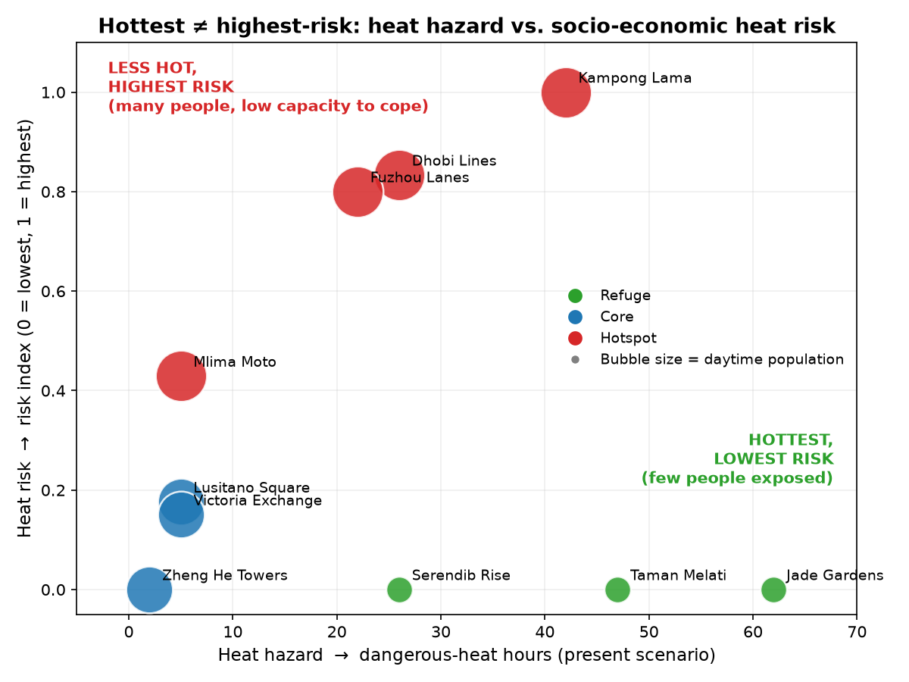

**[Home](index.html) · [Method & Data](method.html) · [Results & Drivers](results.html) · [Caveats](caveats.html) · [Risk Reduction](risk-reduction.html)**

---

This is a **practice repository** for the SUEWS Community Hackathon, run against the
real challenge dataset, [UMEP-dev/uda-city-hackathon](https://github.com/UMEP-dev/uda-city-hackathon),
which is public ahead of/at kickoff. This is a rehearsal of the pipeline and the
analysis approach, not a hackathon submission — the judged entry is a separate
repository created under the `UMEP-dev` organisation on the day.

> **In one line:** the hottest neighbourhoods in this city are not the highest-risk
> ones — low-income, densely populated districts rank highest on heat risk despite
> being *cooler* than the leafy periphery, because risk here is driven by who can't
> escape the heat, not by how hot it gets.

## Where to go from here

- **[Method & Data](method.html)** — the question we asked, the model, the scenarios, and the risk-bridge formula.
- **[Results & Drivers](results.html)** — the full results table, the two headline findings, and the three mechanisms (hazard, exposure, vulnerability) that actually produce the risk ranking.
- **[Caveats](caveats.html)** — where this bridge holds, and where it honestly breaks.
- **[Risk Reduction](risk-reduction.html)** — what this analysis implies for actually reducing heat risk, mapped to the mechanisms we found.

## Pipeline smoke test

Before the real analysis, a minimal SUEWS run via [supy](https://supy.readthedocs.io/)
(the Python interface suews-agent wraps) confirmed the tooling works end to end, using
supy's own bundled sample dataset — see [`analysis/smoke_test.py`](../analysis/smoke_test.py)
and its [output](../analysis/smoke_test_output.txt).

## Citing SUEWS

- Järvi, L., Grimmond, C.S.B. & Christen, A. (2011). The Surface Urban Energy and Water
  Balance Scheme (SUEWS): Evaluation in Los Angeles and Vancouver. *Journal of
  Hydrology*, 411(3–4), 219–237. https://doi.org/10.1016/j.jhydrol.2011.10.001
- Ward, H.C., Kotthaus, S., Järvi, L. & Grimmond, C.S.B. (2016). Surface Urban Energy and
  Water Balance Scheme (SUEWS): Development and evaluation at two UK sites. *Urban
  Climate*, 18, 1–32. https://doi.org/10.1016/j.uclim.2016.05.001
